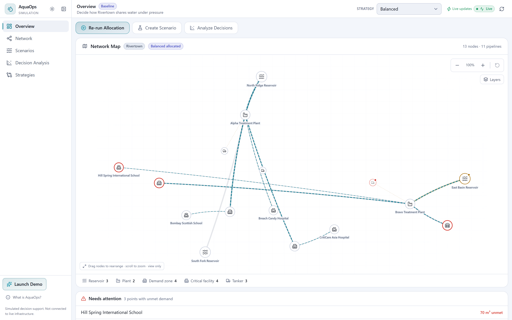
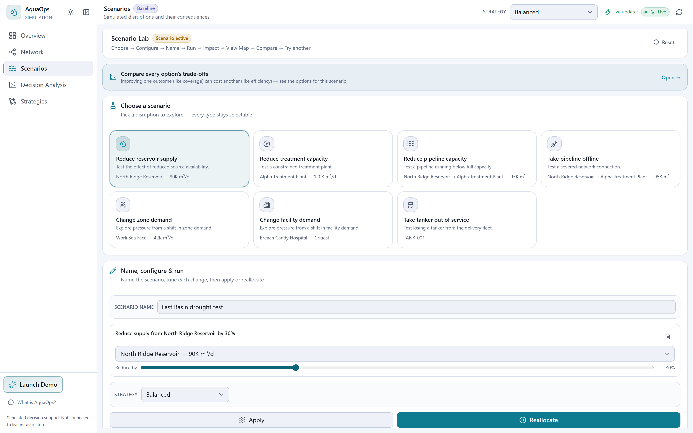
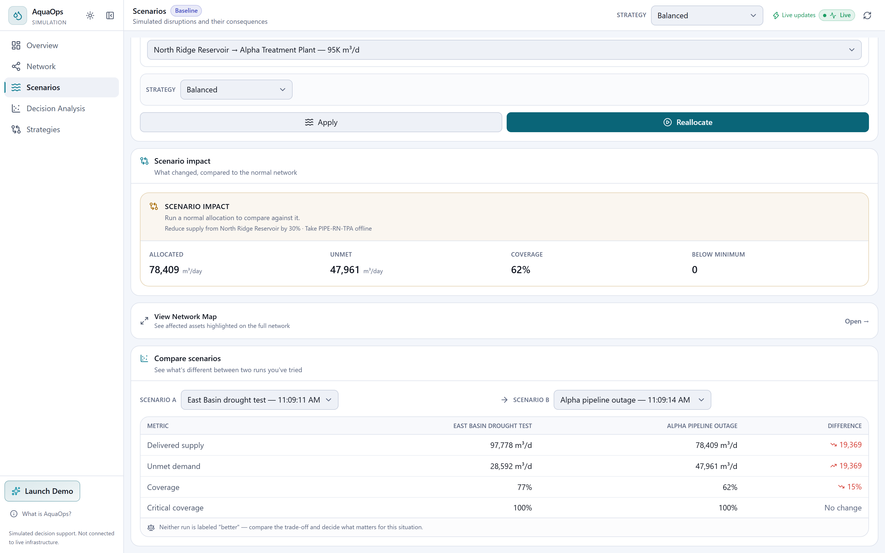
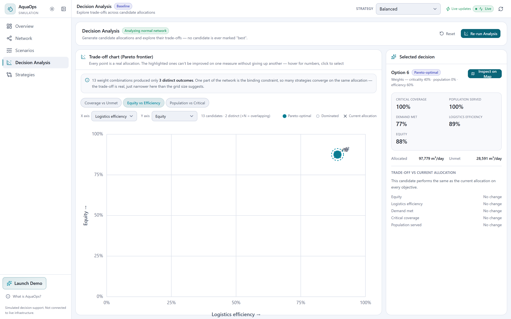
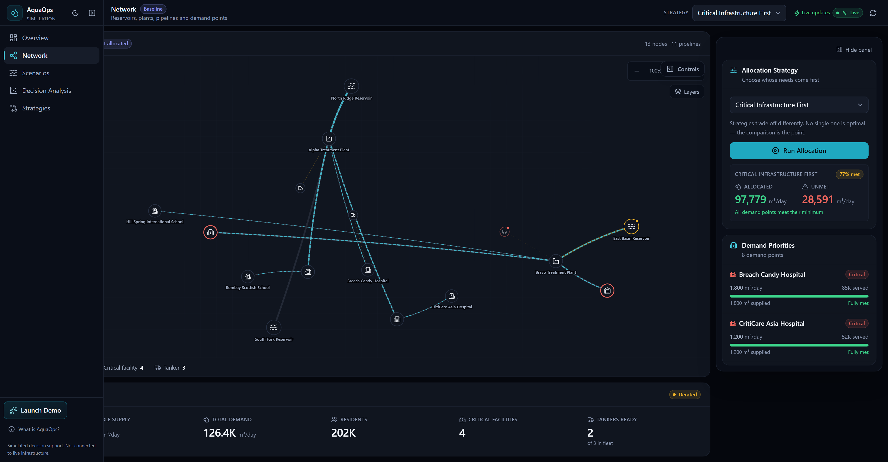
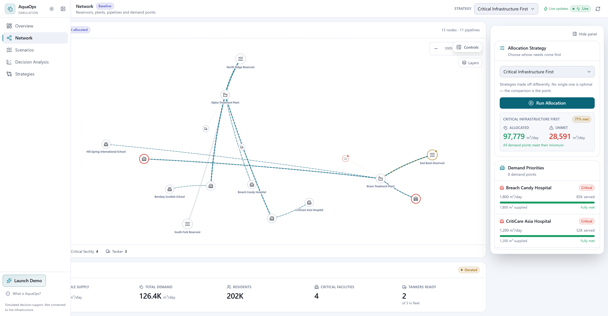
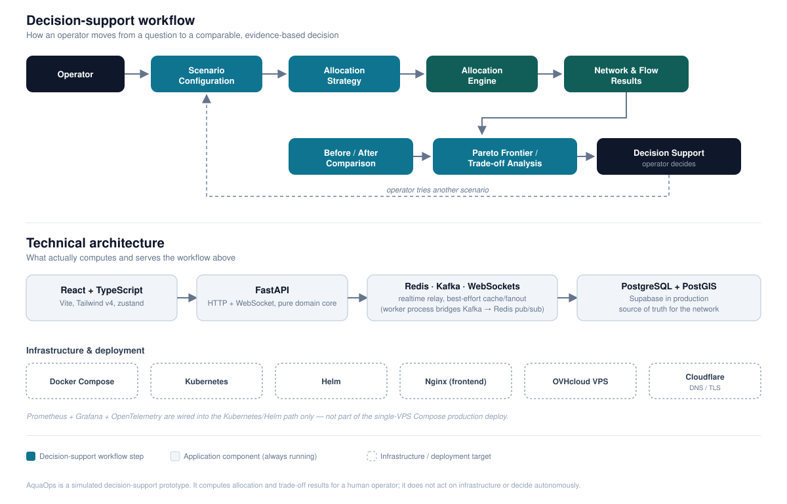

# AquaOps

### Multi-Objective Urban Water Allocation & Decision Support

[](LICENSE)
[](https://github.com/samyaksand/AquaOps)

> **How should a city allocate limited water when supply, infrastructure, population, and critical services compete for the same resources?**

AquaOps turns network information and operational constraints into comparable allocation alternatives. It helps an operator evaluate priorities, scenario impacts, and trade-offs before making a decision. The platform models a disruption or demand change against a simulated urban water network, computes the allocation under a chosen strategy, and surfaces the resulting trade-offs across competing objectives.

> **Simulate decisions. Compare alternatives. Understand trade-offs.**

`React` · `TypeScript` · `FastAPI` · `PostgreSQL/PostGIS` · `Supabase` · `Redis` · `Apache Kafka` · `WebSockets` · `Docker` · `Kubernetes`

---



---

## Why AquaOps?

Urban water allocation is a multi-objective resource-allocation problem, not a single optimization with one correct answer. Serving the most people, protecting critical infrastructure, minimizing waste, and distributing shortfalls equitably are competing priorities. A strategy that maximizes one can degrade another under the same supply.

AquaOps provides the analytical layer for that problem: model a scenario, evaluate allocation alternatives under shared operational constraints, and compare the trade-offs each one makes.

## Core workflow

```
  Scenario  →  Allocation  →  Outcome  →  Comparison  →  Multi-Objective Analysis  →  Trade-Offs  →  Decision
```

An operator configures a scenario, runs it through the allocation engine under a chosen strategy, and gets a computed outcome: delivered supply, unmet demand, coverage. That outcome is compared against a baseline, scored across five objectives, and surfaced as a set of trade-offs.

---

## What you can do

| Capability | What it enables |
|---|---|
| **Scenario Analysis** | Model supply disruptions, infrastructure constraints, and demand changes, then recompute the allocation |
| **Strategy Comparison** | Compare Population First, Critical Infrastructure First, Efficiency First, and Balanced on identical conditions |
| **Network Visualization** | Explore the spatial network: nodes, pipelines, allocation flow, and the assets a scenario affects |
| **Scenario Comparison** | Set two independent scenario runs side by side on the same metrics |
| **Decision Analysis** | Explore allocation alternatives across five objectives and their Pareto trade-offs |

---

## See AquaOps in action

### Scenario Lab



An operator selects a disruption type from the network's own modeled assets, names the scenario, tunes its magnitude, and reallocates. The engine computes the consequence immediately.

### Scenario Comparison



Two independently run scenarios, compared directly on delivered supply, unmet demand, coverage, and critical-facility coverage, with the computed delta between them.

### Decision Analysis



Every point on the chart is a computed allocation. The panel above the chart states plainly when the network's own binding constraint collapses many weight combinations onto the same outcome. This is a genuine property of the modeled network, not smoothed over.

---

## Interface

A **Critical Infrastructure First** allocation, shown in both themes. Every critical facility, including both schools in the network, is fully served.

### Dark mode



### Light mode



---

## Multi-strategy allocation

| Strategy | Decision Priority |
|---|---|
| **Population First** | Population served |
| **Critical Infrastructure First** | Critical facilities |
| **Efficiency First** | Delivery efficiency |
| **Balanced** | Weighted combination of criticality, population, and efficiency |

Each strategy represents a different decision priority, ordering the same demand points differently under identical supply and capacity constraints. The same network can therefore produce materially different outcomes depending on which priority governs the allocation.

## Scenario analysis

An operator can construct a scenario from the network's modeled assets:

Reservoir supply reduction · Treatment plant capacity reduction · Pipeline capacity reduction · Pipeline outage · Zone demand change · Facility demand change · Tanker outage

Modifying a network condition and reallocating evaluates exactly how the change affects delivered supply, unmet demand, coverage, and critical-facility service, against the same baseline.

## Multi-objective decision analysis

Every allocation alternative is evaluated across five normalized objectives:

**Critical-facility coverage** · **Population served** · **Unmet demand** (inverted) · **Logistics/delivery efficiency** · **Equity** (population-weighted deviation from the mean satisfaction ratio)

> Pareto analysis highlights alternatives where improving one objective would require sacrificing another.

AquaOps identifies non-dominated alternatives: solutions for which no other alternative improves one objective without worsening another. These are identified directly from the modeled decision space, never collapsed into a single preferred score.

---

## From information to decision

```
  Network Information  →  Scenario Modeling  →  Analytical Evaluation  →  Decision Alternatives  →  Trade-Off Analysis  →  Human Decision
```

Operational network information becomes a set of analytical alternatives, evaluated on competing objectives, before a decision is made.

---

## Architecture



**Application:** React + TypeScript, the operator-facing interface for scenario modeling, network visualization, and decision analysis.

**Decision & API Layer:** FastAPI + Python, serving HTTP and WebSocket traffic over a pure, independently tested domain core: the allocation, scenario, and decision-analysis engines.

**Data & Spatial Layer:** PostgreSQL/PostGIS, with Supabase as the managed instance for production configuration, storing the network and its geography.

**Real-Time / Distributed Layer:** WebSockets, Apache Kafka, Redis, and a standalone worker process support asynchronous delivery of computed outcomes to connected clients.

**Infrastructure:** Docker, Kubernetes, Helm, Nginx, covering local development, an alternative cluster-deployment path, and the reverse proxy configured for the frontend.

### API

| Group | Endpoint | Purpose |
|---|---|---|
| Health | `GET /health` | Liveness check |
| Network | `GET /network` | Current simulated network state |
| Network | `GET /network/geography` | Node and tanker coordinates for the map |
| Allocation | `POST /allocate` | Run the allocation engine under a chosen strategy |
| Scenario | `POST /scenarios/apply` | Apply a scenario and return the resulting network, without allocating |
| Scenario | `POST /scenarios/allocate` | Apply a scenario and allocate it in one call |
| Decision Analysis | `POST /decision/analyze` | Generate and Pareto-filter candidate allocations |
| Decision Analysis | `POST /decision/score` | Score one allocation on the same five objectives |
| Real-time | `WS /ws` | Typed commands and broadcast of computed outcomes |

## Key engineering & decision-support concepts

- **Multi-objective resource allocation:** five normalized objectives scored on every candidate
- **Spatial information modeling:** a geospatial network (PostGIS) driving an interactive visualization
- **Distributed event processing:** Kafka-backed relay decoupling computation from realtime delivery
- **Reproducible cloud-native infrastructure:** containerized and deployable across Docker Compose and Kubernetes

---

## What makes AquaOps different?

- **Decision support:** evaluates allocation alternatives rather than only visualizing the network
- **Multi-objective analysis:** exposes trade-offs across competing priorities instead of one score
- **Scenario-driven:** recomputes outcomes under explicit, modeled operational changes
- **Human-in-the-loop:** provides analytical evidence without automating the policy decision

---

## Limitations

- Rivertown is a simulated network, not a real city.
- AquaOps is not connected to real water infrastructure and has not been validated for operational deployment.
- Production deployment (OVHcloud/Supabase/Cloudflare) is scripted and documented, not currently live.
- Results depend entirely on the modeled network and its stated assumptions.

## Currently in progress

- **Tracing backend:** OpenTelemetry spans are generated and export over OTLP when configured, but no collector (Jaeger/Tempo) is deployed yet. Traces currently land on console output.
- **Tanker dispatch state:** `idle` / `en_route` / `maintenance` and route data already exist on the tanker model but aren't yet exposed through the API or map. Tankers currently show only a collapsed online/offline state.
- **Benchmarking / load testing:** not yet built.

---

## Technology stack

**Application:** React · TypeScript · FastAPI · Python

**Data & Messaging:** PostgreSQL/PostGIS · Redis · Apache Kafka · WebSockets

**Infrastructure:** Docker · Kubernetes · Helm · Nginx

**Deployment:** Supabase · OVHcloud · Cloudflare

---

## Project structure

```
backend/app/
  domain/        allocation, scenario, and decision engines (pure, independently tested)
  api/            FastAPI routers
  realtime/       WebSocket connection manager and command dispatch
  events/         Kafka topics, event schemas, producer/consumer
  db/             models, Alembic migrations, seed data
backend/tests/    domain, adapter, and API tests

frontend/src/
  components/     map, scenario lab, decision analysis, layout
  store/          zustand application state
  hooks/          data loading and action orchestration

infrastructure/
  docker/         local dev + production Docker Compose
  kubernetes/     raw K8s manifests
  helm/aquaops/   parameterized Helm chart

scripts/deploy-production.sh
```

---

## Getting started

**Prerequisites:** Docker and Docker Compose · Python 3.13 · Node.js 20+

```bash
git clone https://github.com/samyaksand/AquaOps.git
cd AquaOps

# Backend
python -m venv backend/.venv
backend/.venv/Scripts/activate   # or source backend/.venv/bin/activate on Linux/macOS
pip install -r backend/requirements.txt

# Frontend
cd frontend && npm install && cd ..

# Local infrastructure: Postgres/PostGIS, Redis, Kafka
docker compose -f infrastructure/docker/docker-compose.yml up -d

# Migrate and seed (deterministic, safe to rerun)
cd backend
alembic upgrade head
python -m app.db.seed

# Run
uvicorn app.main:app --reload        # backend
cd ../frontend && npm run dev        # frontend
```

- Frontend: **http://localhost:5173**
- Backend: **http://127.0.0.1:8000**

Open the frontend and start in Scenario Lab to model a disruption, reallocate resources, and inspect the resulting trade-offs.

No `.env` file is required for local development. The event worker (`python -m app.worker`, from `backend/`) is optional and only needed to see WebSocket broadcasts relayed via Kafka from a second process.

## Configuration

Production is configured via `backend/.env.production` and `frontend/.env.production`. Both are gitignored and filled in from the tracked `.env.production.example` templates. `Settings` validates itself at startup: for any `ENVIRONMENT` other than `local`, it fails immediately on `DEBUG=true`, a `localhost` `DATABASE_URL`, or a `localhost` `CORS_ORIGINS` entry. `VITE_API_BASE_URL` / `VITE_WS_BASE_URL` are optional Vite build-time arguments, needed only when the frontend and backend are deployed on different origins. Secrets belong only in the real `.env.production` files or your platform's own secret storage.

## Deployment

| Path | Covers | Status |
|---|---|---|
| **Local Docker Compose** | Postgres/PostGIS, Redis, Kafka | Working local development environment |
| **Kubernetes / Helm** | Backend, worker, frontend, plus Prometheus/Grafana observability | Raw manifests and a Helm chart exist as an alternative cluster path |
| **Production Docker Compose (OVHcloud)** | Frontend, backend, worker, Redis, Kafka on a single VPS; Supabase as the database; Cloudflare for DNS/TLS | Scripted (`scripts/deploy-production.sh`) and documented, not currently running |

## Validation

- **271 automated backend tests** (`pytest`) across the domain engines, API, and adapters. A handful of adapter/cache tests skip gracefully when Postgres/Redis/Kafka aren't running locally.
- **TypeScript strict type checking** (`tsc --noEmit`) and a **production frontend build** (`vite build`)
- **Lint** (`oxlint`)
- **Docker production image builds** verified for both backend and frontend
- Core flows (scenario execution, WebSocket relay, Decision Analysis) exercised through **ad hoc Playwright validation** during development, not a checked-in automated frontend suite

```bash
cd backend && pytest
cd frontend && npx tsc --noEmit && npm run build && npm run lint
```

## Design principles

- **Human-in-the-loop decision support:** the system computes and compares; the operator decides
- **Transparent strategy logic:** every strategy's ordering is inspectable code, not a black box
- **Scenario-based reasoning:** operational changes are explicit, reversible modifications to a network state
- **Evidence-based trade-off analysis:** Pareto analysis surfaces genuine conflicts between objectives

---

## License

MIT. See [LICENSE](LICENSE).
